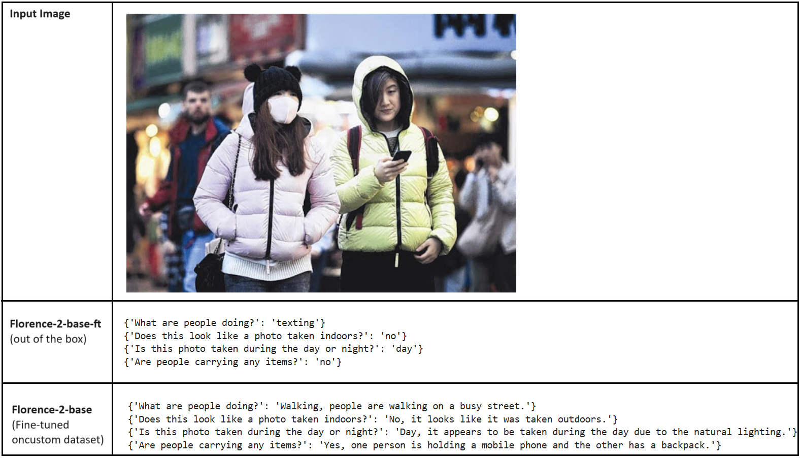

# Florence-2 fine-tuning | Custom Datasets

## About 
This repository demonstrates how florence-2 foundational vision model can be fine-tuned (semi and full) using a custom dataset.
Dataset referenced in the code: [Face mask detection dataset](https://www.kaggle.com/datasets/andrewmvd/face-mask-detection) from Kaggle.

The code is available in the notebooks directory along with innovative use of GPT4-Omni (with few-shot examples) for custom caption generation.

You will need to install Pytorch along with packages listed in the requirements.txt file.

